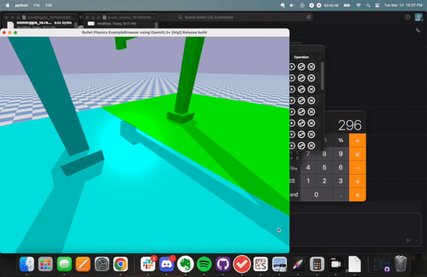

CS396 LudoBots Final Project:

Video: https://youtu.be/AtawNtpbnRk

Paper: https://docs.google.com/document/d/1wgFAZfvZ8TzQfgELJyZFmUiA8rr4QYfzaeDfMWdvLfU/edit?usp=sharing 

Teaser Gif:

 / ! [](experimental.gif)

How to run:


Before running, please ensure that a CPU compatabile version of Pytorch is present on your machine. If you are on a MacOS machine, you can satisfy this requirement with the following code:


```
pip install torch==1.10.0+cu111 torchvision==0.11.1+cu111 torchaudio==0.10.0+cu111 -f https://download.pytorch.org/whl/cu111/torch_stable.html
```


Inside the repository, there is a script ```show_champions.py```. You can use this script to visualize either the "organic" evolutionary track or the "LSTM" evolutionary track by toggling the ```method``` variable at the top of the script. The "organic" method refers to WiggleBots generated with a random mutation method. The "LSTM" method are the series of synaptic weights generated by the neural net.  


This was built off of a rebuilding of the module from Pyrosim and Pybullet - it does not necessarily follow the same structure as the Ludobots module but lessons from Ludobots construction were taken into account. To view the majority of code written for this project, please look at ```tournament.py```
